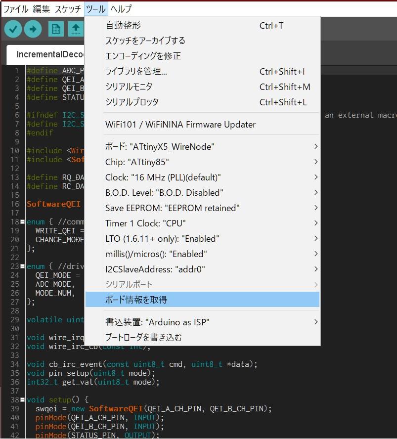

# MDController  version.3

-----

　モータドライバを4つ複数運用するシステムです。また、4つの高精度ロータリーエンコーダのデコードを行うことができます。
　~~version 2？wiki書くのも嫌になる不良品の話はやめろ。~~

## 概要

- [uno/MDController](uno/MDController) ArduinoUNOに対応したプロジェクト。中核として、4つのモータドライバと4つのQEIデバイスの制御を行いI2Cにてホストと通信を行う部分を担当する。

- [tiny85/IncrementalDecoder](tiny85/IncrementalDecoder) Tiny85に対応したプロジェクト。1つのICにつき1つのロータリーエンコーダの運用が可能です。フォルダ内には4つ分のI2Cアドレスがそれぞれ固定済みのプロジェクトが入っています。atTiny85用のビルドには外部提供のブートローダ[SpenceKonde/ATTinyCore](https://github.com/SpenceKonde/ATTinyCore)を改造して用いています。[hardware](hardware)下に配置済み。

## 必要な環境

- Arduino IDE 1.8.9 以降 (推奨)
- ISP(In System Programmer)用のArduinoUNO
- atMega328p-pu (ArduinoUNOのブートローダをSPI経由で書き込んでおいてください。)
- atTiny85-20pu

## 導入

　まず、本リポジトリを任意の位置にクローンします。ここでは、次の通りのパスに配置したとします。
    `C:/Users/UserName/Arduino/MDController_v3`
　Arduino IDE を起動し、`ファイル > 環境設定` から、スケッチの保存場所を本リポジトリのある位置に変更します。

　次に、Tiny85に必要なスケッチを書き込んでいきます。最初に、`ファイル > スケッチ例 > 11.ArduinoISP > ArduinoISP `を選択しISP用のArduinoUNOに書き込んでおきます。
　Tiny85とArduinoUNOを次のように結線し、ArduinoUNO側をPCと接続します。

　Tiny85の設定を行います。`ツール > ボード > ATtinyX5_WireNode`を選択します。それ以外の設定はそのままでよいです。書き込み装置を `Arduino as ISP` に設定し、シリアルポートの状態を確認して、`ブートローダを書き込む` を押して書き込みが終わるのを待てば設定は完了です。なお、ブートローダの書き込みは一度行ったものであれば再度行う必要はありません。

　設定が完了したものにスケッチを書き込みます。接続はブートローダを書き込んだ時の配線と同じです。書き込むスケッチは`ファイル > スケッチブック > tiny85 > IncrementalDecoder`から開くことができます。

　書き込む際は、`ツール > ボード > I2CSlaveAddress`の番号をデバイスごとに指定しながらそれぞれ書き込んでいきます。特に指定がなければ、MDController用に4つ分のaddr0~addr3までの値をしていけば問題ないです。

　次に、atMega328p-pu側のスケッチを書き込む。ArduinoUNOとして扱うので、基板設計の際の発振周波数及び、書き込み部分に関しては[こちら](etc/MDController_sch.png)の回路図を参考にしてください。
　スケッチは`ファイル > スケッチブック > uno > MDController`を書き込んでください。

## 使用方法

　MDControllerの使い方について説明する。

### コンフィグモード

　MDControllerのD12ピンをGND短絡した状態で起動すると、内蔵されたEEPROMに必要な設定をUARTから書き込むコンフィグモードに移行します。LEDが短く点滅する状態が目印です。
　また、デバッグモードでの操作はArduino IDEに付属しているシリアルモニターで行うことを推奨します。

　コンフィグモードが起動すると、UARTモニタに現在設定されている自身のI2CアドレスとPWM出力の周波数及び各ポートのPID制御用の設定が表示されます。これを見て、変更したい項目のコマンドを入力してください。

　コマンドは次の通りです。なお、入力コマンドはASCII文字で大文字小文字を区別し、改行はLFのみです。x,Xには任意の数値が入ります。

| 入力コマンド   | 説明                                                       |
| ------------ | --------------------------------------------------------- |
| `"RR\n"`     | EEPROMの内容を全て初期化します。                               |
| `"a x\n"`    | 本体のI2Cスレーブアドレスを設定します。(x=I2Cアドレス)            |
| `"f x\n"`    | PWM周波数を設定します。(x=PWM周波数[Hz])                       |
| `"px X\n"`   | PIDのPゲインを設定します。(x=ポートID,X=ゲイン(符号なしfloat))   |
| `"ix X\n"`   | PIDのIゲインを設定します。(x=ポートID,X=ゲイン(符号なしfloat))   |
| `"dx X\n"`   | PIDのDゲインを設定します。(x=ポートID,X=ゲイン(符号なしfloat))   |
| `"rx X\n"`   | エンコーダの単相パルスを指定します。(x=ポートID,X=パルス数[PPR])  |
| `"sx X\n"`   | 回転速度の最大値を設定します。(x=ポートID,X=最大回転速度[RPS])    |
| `"SS\n"`     | 変更した事項をEEPROMに書き込みます。                           |

- **設定の際の注意事項**

  EEPROMの書き込み回数には制限があるので、値の更新に問題があった場合、ICの交換をお勧め致します。
  EEPROMの書き換え完了の表示が出るまでは電源を落とさないでください。(約0.5秒未満) 
  回転速度の最大値は、オーバフローの危険があるので制御にあった最大値を設定し、この最大値を超えないような環境で運用してください。

### 通常モード

　MDControllerのD12ピンを解放した状態で起動すると、LEDが点灯し起動処理の後、ホストマイコンと通信を行いモータを操縦する通常モードになります。LEDがゆっくり点滅する状態が目印です。

#### 起動処理について

　必要なセッティングを行います。Tiny85の接続は起動前に行っておいてください。一つも接続されていない場合通常モードへの移行ができません。
　また、UARTの方に起動時の各パラメータを表示しています。I2C通信を行う前に必ずご確認ください。
　
#### 動作中について

　I2C通信を介してホストマイコンと交信を行っています。
　
## リリース

- Copyright (c)  2020 Komazawa

　本ソフトウェアに関して、複製や変更、再配布を原則認めます。ただし、本ソフトウェアを使った事による損害や障害につきましては責任を負いかねますのでご注意ください。
　また、このソフトウェアは現在ライブラリの統合にはライセンスを設けずに行っているため、不特定多数の第三者が閲覧、編集が可能な状態の場所での管理はしないでください。運用はMechaTech部の権利の及ぶ範囲内でのものに留めてください。
　もし、外部に配布した時に生じたいかなる問題に対してこちらは一切関与いたしません。

以上の条文を守ったうえで有益に使っていただけると有難いです。
質問や連絡等はこちらにメールをください。

 taiyou24690@gmail.com

　